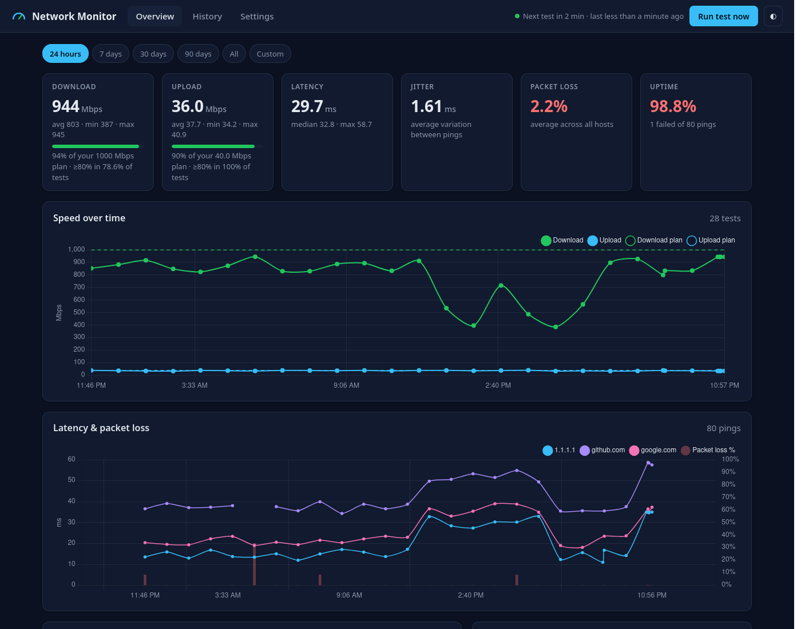
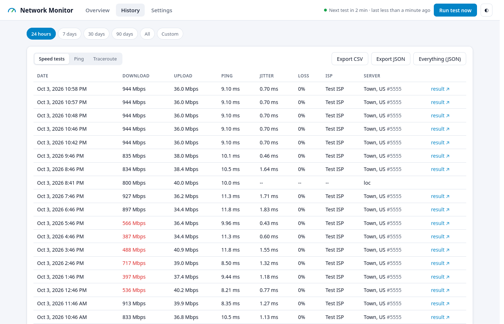

# 🌐 Network Monitor

   

**Is your ISP actually giving you what you pay for?** Network Monitor runs a speed test, pings and traceroutes on a schedule (e.g. every hour), keeps the history, and shows it on a web dashboard, including how often you got your plan's speed.

Runs on **Windows, Linux, macOS, FreeBSD, pfSense, Docker** and Raspberry Pi. It's a single program with no runtime dependencies besides the speed test CLI, which the installers set up for you.



## ✨ Features

* ⚡ **Speed tests** (Ookla Speedtest CLI or Python `speedtest-cli`) with jitter, packet loss, ISP and a link to the speedtest.net result
* 📡 **Ping** any number of hosts: latency, jitter, packet loss and uptime %
* 🧭 **Traceroute** to see *where* slowdowns happen
* 📈 **Charts and stats** for the last 24 h / 7 / 30 / 90 days or any date range
* 🎯 **ISP report card**: enter your plan speed and see what % of tests reached at least 80% of it
* ⚙️ **Settings in the browser**: schedule, hosts, plan, retention, database, password
* ▶️ **Run test now** button, with the schedule lined up to the clock (e.g. every hour on the hour)
* 💾 **SQLite** built in, or **MySQL/MariaDB**
* ⬇️ **Export** to CSV or JSON
* 🔥 **pfSense integration**: shows up under *Status → Network Monitor* in the pfSense web GUI
* 🌗 Light and dark mode, works on phones



---

## 📦 Install

### Linux, macOS, FreeBSD

```bash
curl -fsSL https://raw.githubusercontent.com/HeresJohnny320/network-monitoring-tool/main/scripts/install.sh | sudo sh
```

This downloads the right build for your machine, installs `traceroute` and the Ookla speedtest CLI if they're missing, and sets it up as a service that starts on boot (systemd / launchd / rc.d). Then open **http://localhost:8080**.

Options go after `sh -s --`, for example `| sudo sh -s -- --port 9090`. Run with `--help` to see them all; `--uninstall` removes it.

### Windows

Open **PowerShell as Administrator** and run:

```powershell
irm https://raw.githubusercontent.com/HeresJohnny320/network-monitoring-tool/main/scripts/install.ps1 | iex
```

It installs to `C:\Program Files\NetworkMonitor`, puts `speedtest.exe` next to it, starts it in the background at every boot, and opens the dashboard.

### pfSense

In the pfSense web GUI go to **Diagnostics → Command Prompt** (or SSH in and choose option 8, *Shell*) and run:

```sh
fetch -o - https://raw.githubusercontent.com/HeresJohnny320/network-monitoring-tool/main/scripts/install.sh | sh
```

Then refresh the pfSense GUI and open **Status → Network Monitor**. The full dashboard, history and settings are right there, behind your pfSense login and HTTPS. By default the monitor only listens on `127.0.0.1`, so nothing new is exposed on your network. Add `-s -- --lan` to the `sh` command if you also want to reach it directly at `http://<firewall-ip>:8080`.

* Speed tests use the Python `speedtest-cli` package from the pfSense package repo (installed automatically).
* Data is kept in `/usr/local/etc/netmon`. Logs go to *Status → System Logs* (tag `netmon`).
* After a major pfSense upgrade, re-run the command above if the menu entry disappears.
* Uninstall: `fetch -o - <same url> | sh -s -- --uninstall`

### Docker

```bash
docker run -d --name network-monitor --restart unless-stopped \
  -p 8080:8080 -v ./netmon-data:/data -e TZ=America/New_York \
  ghcr.io/heresjohnny320/network-monitoring-tool:latest
```

Or use the included [`docker-compose.yml`](docker-compose.yml): `docker compose up -d`.

### Manual

Download the archive for your platform from **[Releases](https://github.com/HeresJohnny320/network-monitoring-tool/releases)**, extract it and run `network_monitor_tool` (`.exe` on Windows). The dashboard opens automatically on first run. You'll need the [Speedtest CLI](https://www.speedtest.net/apps/cli) installed for speed tests.

| Platform | Archive |
|---|---|
| Windows (64-bit / ARM) | `windows_amd64.zip` / `windows_arm64.zip` |
| macOS (Intel / Apple Silicon) | `darwin_amd64` / `darwin_arm64` |
| Linux (PC / ARM 64-bit / Raspberry Pi 32-bit / old 32-bit PC) | `linux_amd64` / `linux_arm64` / `linux_armv7`, `linux_armv6` / `linux_386` |
| FreeBSD & pfSense | `freebsd_amd64` / `freebsd_arm64` |

---

## ⚙️ Configuration

Everything can be changed from the **Settings** tab. It's stored in `config.json`:

| Installed with | Location |
|---|---|
| Linux service | `/var/lib/netmon` |
| macOS service | `/Library/Application Support/netmon` |
| FreeBSD service | `/var/db/netmon` |
| pfSense | `/usr/local/etc/netmon` |
| Windows service | `C:\ProgramData\NetworkMonitor` |
| Docker | `/data` (mount a volume) |
| Run by hand | `%APPDATA%\heresjohnnys320_network_monitor_tool` (Windows), `~/.config/heresjohnnys320_network_monitor_tool` (Linux/FreeBSD), `~/Library/Application Support/heresjohnnys320_network_monitor_tool` (macOS) |

Use `-data-dir <path>` (or the `NETMON_DATA_DIR` environment variable) to put it anywhere else. Missing options are filled in with defaults.

```json
{
  "run_ping": true,
  "run_traceroute": true,
  "run_speedtest": true,
  "ping_host": ["google.com", "github.com", "1.1.1.1", "8.8.8.8"],
  "ping_count": 4,
  "traceroute_host": ["google.com", "github.com"],
  "speedtest_server_id": "",
  "speedtest_engine": "auto",
  "speedtest_path": "",
  "plan_download_mbps": 500,
  "plan_upload_mbps": 50,
  "run_every": "1h",
  "align_to_clock": true,
  "retention_days": 0,
  "listen": ":8080",
  "ui_password": "",
  "run_sql": false,
  "sql_user": "user",
  "sql_password": "password",
  "sql_host": "localhost",
  "sql_port": "3306",
  "sql_database": "network_tool"
}
```

| Option | What it does |
|---|---|
| `run_every` | How often to test: `30m`, `1h`, `1h30m`, `1d`… (minimum `30s`). The first run happens at startup. |
| `align_to_clock` | Run on round times (`1h` → 1:00, 2:00, …) instead of counting from startup. |
| `ping_count` | Pings per host per run. More pings give better packet loss and jitter numbers. |
| `speedtest_server_id` | Pin a speed test server (`speedtest -L` lists them). Blank = closest. |
| `speedtest_engine` | `auto`, `ookla` or `python`. `speedtest_path` points at a specific binary. |
| `plan_download_mbps` / `plan_upload_mbps` | Your plan's speeds, for the "% of plan" stats. `0` hides them. |
| `retention_days` | Delete results older than this. `0` keeps everything. |
| `listen` | `:8080` = reachable from your network, `127.0.0.1:8080` = this computer only. Needs a restart. |
| `ui_password` | Ask for a password before showing the dashboard (any username works). |
| `run_sql` + `sql_*` | Store results in MySQL/MariaDB instead of the built-in SQLite file. |

Command line flags: `-data-dir`, `-listen`, `-no-browser`, `-version`.

---

## 🔌 API

Everything the dashboard shows is available as JSON. Add `?from=` / `?to=` (RFC 3339 like `2026-10-01T00:00:00Z`, or `2026-10-01`) to pick a time range.

| Endpoint | Returns |
|---|---|
| `GET /api/summary` | Averages, min/max, uptime, % of plan, latest results (default: last 24 h) |
| `GET /api/speedtest` | Speed tests (`download_mbps`, `upload_mbps`, `ping_ms`, `jitter_ms`, `packet_loss`, `isp`, `result_url`, …) |
| `GET /api/ping` | Pings (`host`, `success`, `time_ms`, `loss_pct`, `jitter_ms`); `?host=` filters |
| `GET /api/traceroute` | Traceroutes with hops; `?limit=` |
| `GET /api/export?type=speedtest\|ping\|traceroute\|all&format=csv\|json` | File download |
| `GET /api/status` | Version, next run, whether a run is in progress, installed tools |
| `POST /api/run` | Start a test run now |
| `GET/POST /api/config` | Read / change settings (JSON body; passwords are never returned) |

The original `/ping`, `/speedtest` and `/traceroute` endpoints still work the same as before (speeds in bytes/sec).

---

## ❗ Troubleshooting

* **No speed test results**: check the red banner on the dashboard. It tells you what's missing and how to install it. Ookla's license is accepted automatically so it can run unattended.
* **Can't open the dashboard from another device**: make sure `listen` is `:8080` (not `127.0.0.1:8080`) and that your firewall allows the port.
* **"address already in use"**: another copy is already running, or something else uses port 8080. Change `listen` or start with `-listen :9090`.
* **Logs**: `journalctl -u netmon -f` (Linux), `/var/log/netmon.log` (macOS), syslog tag `netmon` (FreeBSD/pfSense), `docker logs network-monitor`.

---

## 🛠️ Building

Requires Go 1.26+. No C compiler is needed (the SQLite driver is pure Go).

```bash
go run .                 # run from source
go test ./...            # tests
./build.sh               # release archives for every platform into dist/
./build.sh linux/arm64   # just one platform
```

**Releases are automatic:** every push builds all platforms on GitHub Actions ([`.github/workflows/build.yml`](.github/workflows/build.yml)), and pushing a version tag publishes a GitHub release with all archives, checksums and a multi-arch Docker image:

```bash
git tag v1.5.0
git push origin v1.5.0
```

The old Java version is still available in `java.zip`.

---

## 🔒 Privacy

* All data stays on your machine (or your own MySQL server)
* The only outside traffic is the tests themselves (pings, traceroutes, speedtest.net)
* Free and open source ([MIT](LICENSE))

## 🔗 Links

* [Project repository](https://github.com/HeresJohnny320/network-monitoring-tool/)
* [Latest release](https://github.com/HeresJohnny320/network-monitoring-tool/releases)
